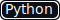
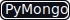

# Получение входящих писем из почтового ящика "mail.ru"
    

### Получаем данные:
- "_id" - в качестве Id ссылка на письмо
- "title" - тема письма
- "letter_author" - автор письма
- "letter_date" - дата
- "letter_content" - текст письма

### Обработанные данные сохраняем в базу данных MongoDB.
**letters_db**

---

## Для работы необходимо:
1. Установить библиотеку Selenium: ```pip install selenium```.
2. Скачать и распаковать драйвер для вашего браузера. Можно найти на странице: *https://www.selenium.dev/documentation/webdriver/getting_started/install_drivers/*
3. Указать в импорте соответствующий webdriver.
4. В строке ```s = Service('<путь_к_драйверу>')``` указать путь к файлу драйвера (куда вы его распаковали).
5. В строке ```driver = webdriver.<Браузер>(service=s)``` указать драйвер вашего браузера.


Например:

Я использовал Firefox (https://github.com/mozilla/geckodriver/releases)

В импорте:
```python
from selenium.webdriver.firefox.service import Service
```
(для Chrome: ```from selenium.webdriver.chrome.service import Service```)

путь (я положил в папку проекта) до файла драйвера:
```python
s = Service('./geckodriver')
```
(для Chrome: ```s = Service('./chromedriver')```)

драйвер браузера:
```python
driver = webdriver.Firefox(service=s)
```
(для Chrome: ```driver = webdriver.Chrome(service=s)```)

---

Запустить контейнер с MongoDB:
```commandline
docker run -d --name mongo_scrap -p 27017:27017 -v mongodb_scrap:/data/db mongo
```

В файле ```settings.py``` необходимо указать IP-адрес и порт сервера MongoDB:
```python
HOST = '192.168.2.230'  # укажите IP-адрес
PORT = 27017             # укажите порт (27017 стандартный порт MongoDB)
```

Так же можно указать базу данных (letters_db):
```python
db = client['letters_db']
```

и коллекции (letters и duplicates):
```python
letters = db['letters']  # письма
duplicates = db['duplicates']  # дубликаты
```

Необходимо установить:
```commandline
pip install selenium
pip install lxml
pip install pymongo
pip install python-dotenv
```

или
```commandline
pip install -r requirements.txt
или
python -m pip install -r requirements.txt
```

---

Создайте файл ```.env```.
- Добавьте строки:
```commandline
mail_login="login@mail.ru"
mail_password="Password"
```
- Замените ```login@mail.ru``` на свой логин/адрес.
- Замените ```Password``` на свой пароль.
